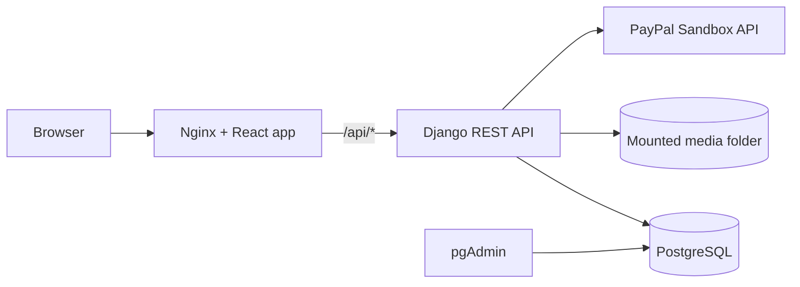

<div align="center">
  

  <p><strong>A full-stack marketplace for listing, browsing, wishlisting, carting, and buying vintage books.</strong></p>

  <p>
    
    
    
    
    
    
    
    
  </p>
</div>

## Overview

Vintage Book Market is a full-stack web application where users can create accounts, list books for sale, browse available books, maintain a wishlist, manage a shopping cart, and start PayPal sandbox checkout. The frontend is a React/Vite single-page app served by Nginx in Docker, and the backend is a Django REST Framework API backed by PostgreSQL.

## Project Links

| Area | Path | Purpose |
| --- | --- | --- |
| Root app | [`docker-compose.yml`](docker-compose.yml) | Runs frontend, backend, PostgreSQL, and pgAdmin together |
| Backend docs | [`backend/README.md`](backend/README.md) | Django API, env variables, Docker, endpoint reference |
| Frontend docs | [`frontend/README.md`](frontend/README.md) | React app, routes, scripts, API proxy behavior |
| Backend env template | [`backend/.env.example`](backend/.env.example) | Safe template for local backend configuration |
| Frontend env template | [`frontend/.env.example`](frontend/.env.example) | Safe template for frontend API configuration |

## Tech Stack

| Layer | Tools |
| --- | --- |
| Frontend | React 18, Vite 5, Redux Toolkit, React Router, Axios, Tailwind CSS, Framer Motion |
| Backend | Python 3.11, Django 5.1, Django REST Framework, Simple JWT, Gunicorn |
| Database | PostgreSQL 15 in Docker |
| Web server | Nginx serving the production frontend and proxying `/api` |
| Auth | JWT access/refresh tokens with profile management |
| Payments | PayPal sandbox order creation |
| DevOps | Docker, Docker Compose, `.env` templates, `.dockerignore` files |

## Feature Guide

| Feature | Frontend experience | Backend area | Notes |
| --- | --- | --- | --- |
| Authentication | Register, login, logout, token refresh | `UserDetails` | Uses JWT access and refresh tokens |
| Profile management | View profile, edit profile, change password | `UserDetails` | Supports profile image uploads |
| Browse books | Browse and search books | `ManageProducts` | Supports pagination and filtering inputs |
| Sell books | Create book listings with image upload | `ManageProducts` | Listings are tied to the authenticated user |
| Manage listings | View, edit, and delete your own books | `ManageProducts` | Protected by authentication |
| Cart | Add books, remove books, view billing summary | `ManageCart` | Prevents users from buying their own listings |
| Wishlist | Add and remove wishlist items | `ManageCart` | Paginated wishlist view |
| Payment | Checkout with PayPal sandbox | `ManageCart` | Uses PayPal credentials from `backend/.env` |
| Static frontend | Production React build served by Nginx | `frontend/nginx.conf` | API traffic is routed through `/api` |

## Architecture



## Project Structure

```text
Vintage_book_selling/
  backend/
    ManageCart/
    ManageProducts/
    UserDetails/
    old_book_sell/
    Dockerfile
    docker-compose.yml
    requirements.txt
  frontend/
    src/
      components/
      config/
      redux/
    Dockerfile
    docker-compose.yml
    nginx.conf
    package.json
  docker-compose.yml
  README.md
```

## Quick Start With Docker

From the repository root:

```bash
docker compose up --build
```

Open these URLs:

| Service | URL |
| --- | --- |
| Frontend | http://localhost:3000 |
| Backend API | http://localhost:8000 |
| Django admin | http://localhost:8000/admin |
| pgAdmin | http://localhost:8080 |
| PostgreSQL | `localhost:5432` |

Stop the stack:

```bash
docker compose down
```

Stop and remove local database volumes:

```bash
docker compose down -v
```

## Environment Setup

Copy the example files before running on a new machine:

```bash
cp .env.example .env
cp backend/.env.example backend/.env
cp frontend/.env.example frontend/.env
```

Secrets belong in `.env` files only. Do not commit real `SECRET_KEY`, database passwords, or PayPal credentials.

## Important Environment Values

| File | Key | Purpose |
| --- | --- | --- |
| `.env` | `DB_NAME`, `DB_USER`, `DB_PASSWORD`, `DB_PORT` | Compose-level database defaults |
| `backend/.env` | `SECRET_KEY` | Django secret key |
| `backend/.env` | `DB_HOST=postgres` | Container database host |
| `backend/.env` | `PAYPAL_CLIENT_ID`, `PAYPAL_CLIENT_SECRET` | PayPal sandbox credentials |
| `frontend/.env` | `VITE_API_BASE_URL=/api` | Browser-facing API base path |
| `frontend/.env` | `VITE_API_PROXY_TARGET=http://localhost:8000` | Local Vite dev proxy target |

## Docker Services

| Service | Image/build | Port | Description |
| --- | --- | --- | --- |
| `frontend` | `./frontend` | `3000:80` | Production React app served by Nginx |
| `backend` | `./backend` | `8000:8000` | Django API running with Gunicorn |
| `postgres` | `postgres:15` | `5432:5432` | Application database |
| `pgadmin` | `dpage/pgadmin4` | `8080:80` | PostgreSQL admin UI |

## Common Commands

| Task | Command |
| --- | --- |
| Run full stack | `docker compose up --build` |
| Run in background | `docker compose up --build -d` |
| View backend logs | `docker compose logs -f backend` |
| View frontend logs | `docker compose logs -f frontend` |
| Create Django superuser | `docker compose exec backend python manage.py createsuperuser` |
| Run migrations manually | `docker compose exec backend python manage.py migrate` |
| Stop containers | `docker compose down` |
| Reset database volumes | `docker compose down -v` |

## API Summary

All frontend production API calls go through `/api`, which Nginx proxies to the backend container.

| Domain | Base path | Examples |
| --- | --- | --- |
| Auth and users | `/api/userDetails/` | `register/`, `login/`, `profile/`, `edit-profile/`, `change-password/` |
| Books | `/api/manage_p/` | `books/`, `books/<id>/`, `books/create/`, `user/books/` |
| Cart and wishlist | `/api/manage_c/` | `cart/`, `wishlist/`, `cart/paypal-payment/` |

## Local Development Without Docker

Backend:

```bash
cd backend
python -m venv .venv
.venv\Scripts\activate
pip install -r requirements.txt
python manage.py migrate
python manage.py runserver
```

Frontend:

```bash
cd frontend
npm install
npm run dev
```

The Docker flow is the recommended path because it aligns PostgreSQL, Nginx, frontend routing, and backend runtime settings.

## Security Notes

- Real `.env` files are ignored by git.
- `backend/db.sqlite3` is not part of the Docker flow and should stay untracked.
- PayPal sandbox credentials should live only in `backend/.env`.
- Use `DEBUG=False`, production credentials, and production PayPal endpoints before deploying publicly.

## Troubleshooting

| Problem | Fix |
| --- | --- |
| Docker cannot pull images in WSL with credential errors | Remove `credsStore` / `credHelpers` from `~/.docker/config.json` or reset it to `{ "auths": {} }` |
| Frontend cannot reach API | Confirm `VITE_API_BASE_URL=/api` and Nginx is running through Docker |
| Backend cannot connect to database | Confirm Compose is using `DB_HOST=postgres` |
| Uploaded images do not appear | Confirm `backend/media` is mounted and Django `MEDIA_ROOT=/app/media` |
